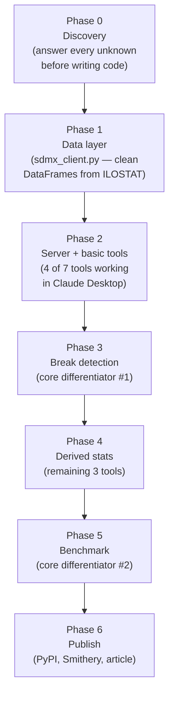
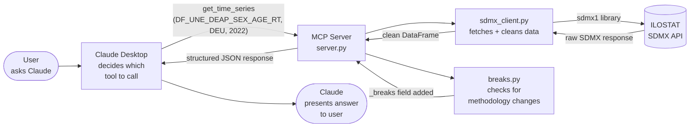
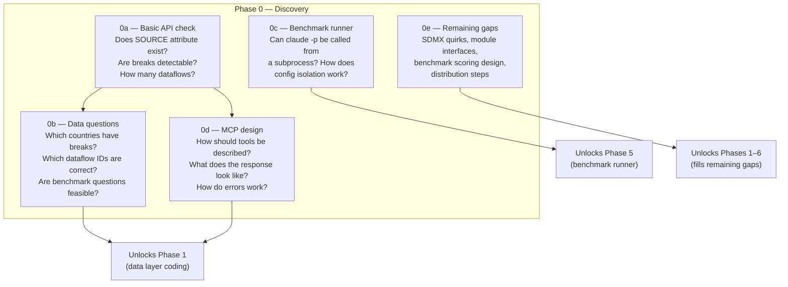
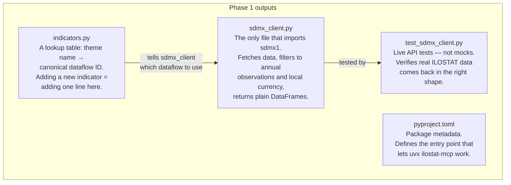
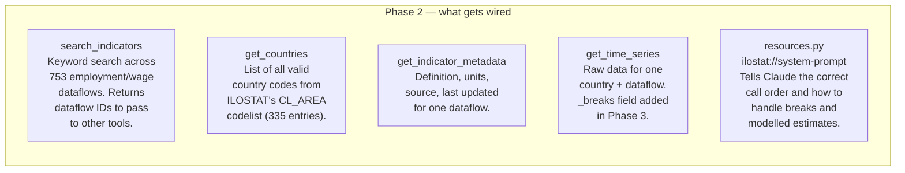
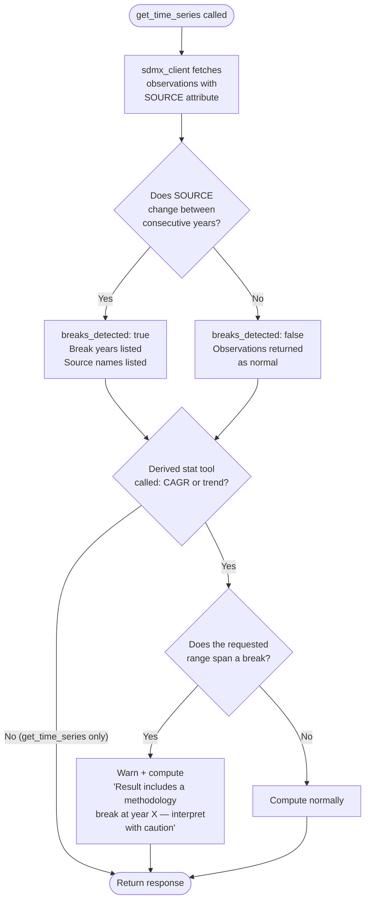
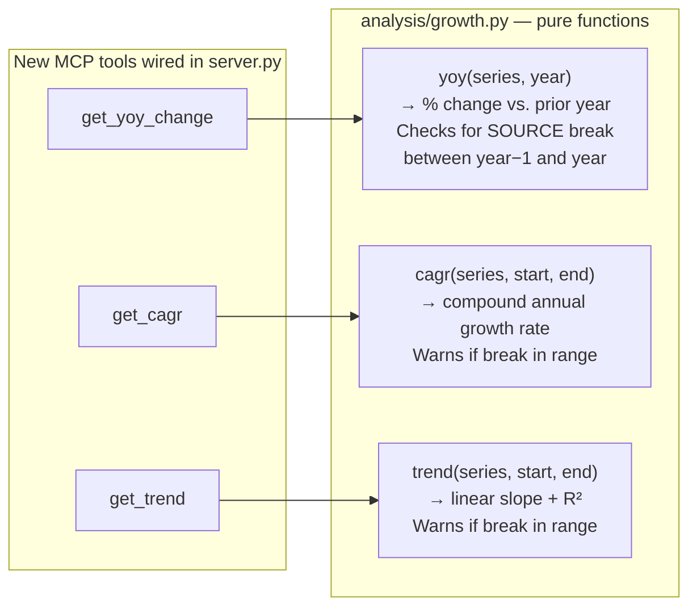
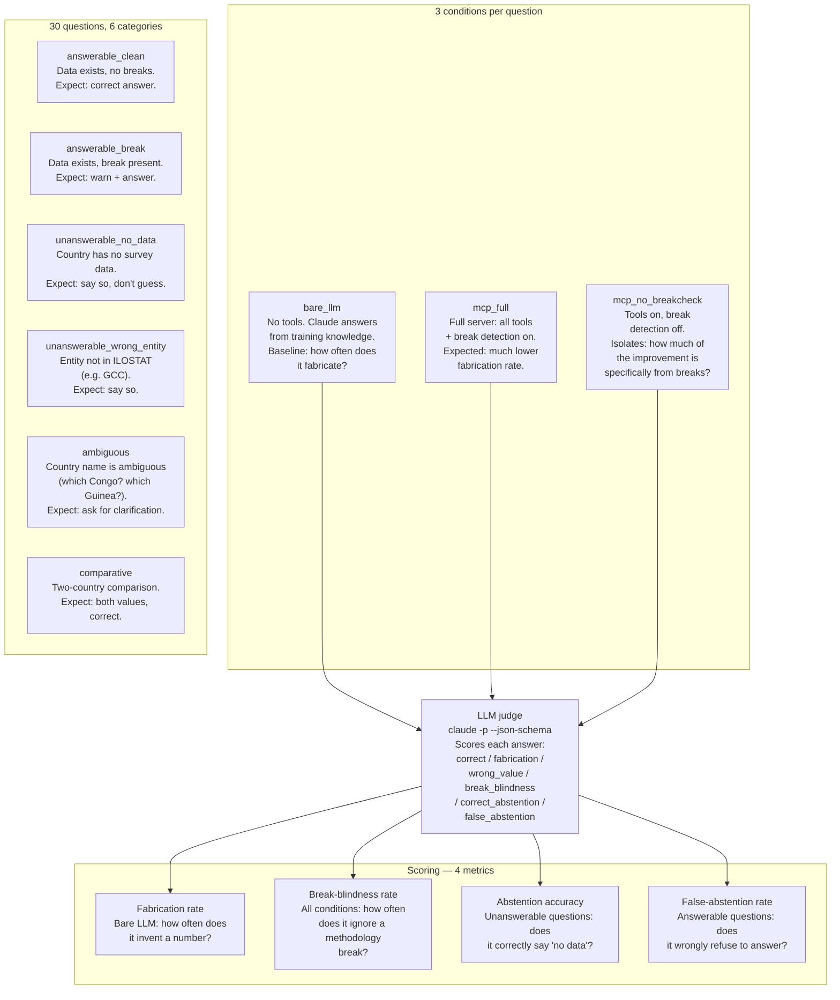
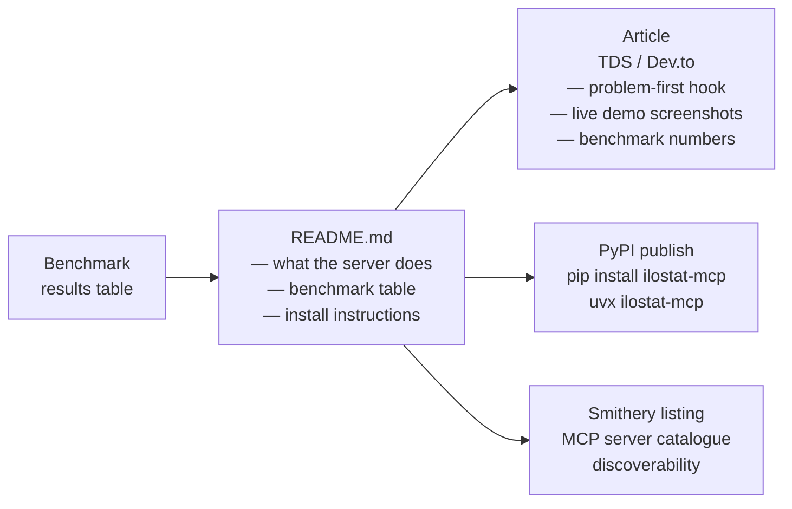
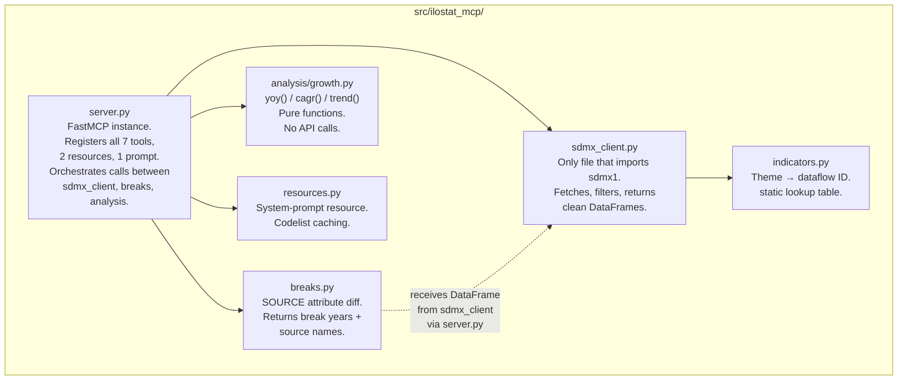

# ILOSTAT MCP — Overall Development Steps

A plain-English walkthrough of every phase, what gets built, why the order matters, and how each piece connects to the next. Written for re-orientation at the start of a session, not for an outside reader.

---

## What this project is

See `plan/use_cases.md` — the full description lives there, alongside the supported query list and the design principles that make the server work correctly with LLMs.

In one sentence: an MCP server that gives Claude access to live ILOSTAT employment and wage data, with automatic methodology-break detection and a hallucination benchmark that proves the tool does something a bare LLM cannot.

---

## High-level phase sequence

Each phase is a strict prerequisite for the next. No production code gets written until Phase 0 is done.

---

## How a tool call works end-to-end

This is the runtime picture — what happens when someone asks Claude "What was Germany's unemployment rate in 2022?"

The key rule: `sdmx1` (the SDMX library) never appears outside `sdmx_client.py`. Everything above it speaks plain Python dicts and DataFrames.

---

## Phase 0 — Discovery

**What:** Run scripts against the live ILOSTAT API to answer every "will this actually work?" question before committing to an implementation.

**Why:** ILOSTAT's SDMX API has quirks you can't find in any docs — response shapes that differ from spec, attributes that exist in theory but aren't populated in practice. Discovering these mid-build means rewriting production code. Discovering them in throwaway scratch scripts costs nothing.

Phase 0 has five sub-phases. Their outputs are decisions, not code.

### What each sub-phase answers

| Sub-phase | Core question | Unlocks |
|---|---|---|
| **0a** | Does ILOSTAT's SDMX API return what we expect? | Everything |
| **0b** | Are the specific benchmark questions correctly set up? | Benchmark ground-truth lookup (Kanza) |
| **0c** | Can `claude -p` be scripted for the benchmark runner? | Phase 5 |
| **0d** | How should the MCP tools be designed? | Phase 2 |
| **0e** | What did 0a–0d miss? | Phases 1–6 (one gap each) |

**Key finding from 0a:** `OBS_PRE_BREAK_VALUE` — the SDMX standard break flag — is not populated by ILOSTAT. Break detection must rely on SOURCE attribute changes instead.

**Key finding from 0b:** Somalia has data (question premise was wrong). EU has codes in CL_AREA (also wrong). Both questions were rewritten. All 30 benchmark questions now have locked dataflow IDs.

**Key finding from 0c:** `CLAUDE_CONFIG_DIR` doesn't work for isolation (auth is in the macOS keychain). Use `--mcp-config <path> --strict-mcp-config` instead. 15-minute serial benchmark run is fine; no parallelisation needed.

---

## Phase 1 — Data Layer

**What:** Write one Python file — `sdmx_client.py` — that talks to ILOSTAT and returns clean, filtered data. Nothing else.

**Why:** Every other file in the project depends on data arriving in a predictable shape. Break detection, derived stats, and the tools all call into this layer. Building the server before the data layer is stable means debugging two things at once.

**Rule enforced here:** `sdmx1` specifics — response parsing, key filter syntax, attribute extraction — never appear outside `sdmx_client.py`. Any file that needs data calls a function in `sdmx_client`; it never touches the `sdmx1` library directly.

**What "clean" means:**
- Filtered to annual observations only (ILOSTAT mixes annual, monthly, quarterly)
- Filtered to local currency for wage flows (otherwise three rows per year: LCU, PPP, USD)
- SOURCE attribute preserved per observation (break detection needs it)
- Modelled estimates labelled (`data_type: "modelled_estimate"`) vs. survey data (`data_type: "survey"`)

---

## How the server teaches Claude to behave correctly

Before Phase 2 is built, it's worth understanding the design principles that make the server work correctly with Claude — not just return data, but cause Claude to use it right. These principles are implemented in Phase 2 (tool descriptions, response structure, system prompt) and Phase 3 (break warnings). The decisions below come from Phase 0d research.

Claude doesn't automatically know how to use this server correctly. It learns entirely from what we write. There are seven levers:

**1. Tool descriptions (docstrings)** — the most important layer. Before every tool call, Claude reads the docstring to decide whether to call the tool, what to pass, and what to expect back. A precise docstring produces correct behaviour. A vague one produces wrong tool calls, invented parameters, and guessed dataflow IDs.

**2. Negative constraints in descriptions** — explicitly saying what NOT to do is more reliable than only saying what to do. *"Never invent a dataflow ID — always use `search_indicators` first."* *"Do not pass country names like 'Germany' — always use ISO codes like 'DEU'."* Claude follows these constraints reliably when they are stated.

**3. Concrete examples in parameter descriptions** — *"e.g. 'GBR' for United Kingdom, 'MYS' for Malaysia"* eliminates format ambiguity entirely. Claude stops guessing and uses the pattern shown.

**4. System prompt resource** (`ilostat://system-prompt`) — standing instructions loaded once at connection time. Cross-cutting rules: always resolve country ambiguity before calling any tool; never answer from training knowledge if the tool returns `has_data: false`; always check `breaks_detected` before stating a trend. Also encodes call ordering: `search_indicators` → `get_time_series` → derived stats — never skip steps.

**5. Response structure** — the shape of what the tool returns directly shapes Claude's behaviour. Three things matter: (a) make data absence explicit — `{"has_data": false}` instead of an empty result, because an empty result looks like a bug while `has_data: false` is an answer; (b) put critical flags at the top level of the response — `breaks_detected: true` at the root, not buried inside `observations`, because Claude processes top-down and may draft its answer before reaching a buried flag; (c) keep field names consistent across all tools so Claude isn't tracking two schemas.

**6. Interpretation hints in responses** — beyond the boolean flag, a plain-English field in the response body reinforces what to do with it. `"note": "This series has a methodology break at 2019 — do not compute a single trend across this range."` The flag signals the condition. The hint tells Claude what that means for its answer. Both are needed.

**7. Actionable error messages** — when a tool call fails, the error should tell Claude what to do next. *"Country code 'United Kingdom' not recognised — call `get_countries()` to find valid codes"* is actionable. *"Invalid parameter"* is not.

| Missing layer | What goes wrong |
|---|---|
| Vague tool description | Claude guesses which tool to call, invents parameter values, picks wrong flows |
| No negative constraints | Claude passes country names instead of codes, invents dataflow IDs |
| No concrete examples | Claude guesses parameter format — sometimes correctly, sometimes not |
| No disambiguation instruction | Claude picks a country arbitrarily (often the more famous one) and answers confidently |
| No call ordering in system prompt | Claude calls derived-stat tools without fetching data first, or skips `search_indicators` |
| No `has_data: false` field | Claude doesn't know when to abstain — supplements with training knowledge |
| No "don't use training knowledge" rule | Claude answers unsupported parts (inflation, forecasts) from memory alongside tool results, without flagging the source difference |
| Critical flags buried in response | Claude misses break warnings, computes trends across methodology changes |
| No interpretation hint | Claude sees `breaks_detected: true` but doesn't know what action to take |
| Generic error messages | Claude retries with the same wrong input rather than correcting it |

---

## Phase 2 — Server + Basic Tools

**What:** Wrap the data layer in a FastMCP server. Wire up four of the seven tools. Verify it works end-to-end in Claude Desktop.

**Why stop at four tools?** Break detection (`breaks.py`) doesn't exist yet, and `get_cagr` / `get_trend` / `get_yoy_change` all depend on it. The four tools that don't need breaks are wired first, so we have a working server to test against while Phase 3 is built.

**Verification step:** MCP Inspector first, Claude Desktop second. MCP Inspector lets you see raw tool call/response JSON without going through Claude — catches description and schema problems before they become harder-to-debug Claude Desktop issues.

**Phase 0c deferred checks run here:** five unknowns about MCP server behaviour (server lifecycle per `claude -p` call, tool-call output format, parallel config contention, env var inheritance, MCP call timing) that couldn't be checked without a real server.

---

## Phase 3 — Break Detection

**What:** Write `breaks.py`. Every `get_time_series` response now automatically includes a `_breaks` field. `get_cagr` and `get_trend` warn before computing if the requested range spans a detected break.

**Why this is core differentiator #1:** Consider Pakistan's wage data — the survey source switches between a Labour Force Survey and a Household Income and Expenditure Survey six times between 2011 and 2021. Computing a CAGR across that series as if it's one continuous measurement gives a number that looks precise but is methodologically meaningless. A bare LLM has no access to this information. This server catches it automatically.

**What `breaks.py` sees:** a single annual time series (one row per year) with a SOURCE column. It does not see a multi-dimensional DataFrame — `sdmx_client.py` collapses to the canonical total-sex, working-age series before passing data along.

**Test data:** Nigeria (`NGA`) — confirmed breaks in 2011 and 2019. Pakistan (`PAK`) — five breaks in 2010–2020. Thailand (`THA`) — wage breaks in 2013 and 2014. These are tested against live ILOSTAT, not fixtures.

---

## Phase 4 — Derived Stats + Remaining Tools

**What:** Write `analysis/growth.py` with three pure math functions — `yoy()`, `cagr()`, `trend()` — then wire them as the final three MCP tools.

**Why pure functions?** The math can be unit-tested without hitting the API. Each function takes a list of `(year, value)` pairs and returns a result dict. No network calls, no side effects. The server passes data in from `sdmx_client`; the functions just do arithmetic.

**The seven tools are now complete.** Break warnings from `breaks.py` are added by `server.py` — the math functions themselves stay pure and know nothing about breaks.

---

## Phase 5 — Hallucination Benchmark

**What:** Run all 30 benchmark questions three ways, score each answer automatically with an LLM judge, and produce a results table.

**Why three conditions?** We want to isolate what's actually driving improvement. Tool access alone (giving Claude ILOSTAT data) should cut fabrication. Break detection on top of that should cut a different failure mode — giving a number without warning about a methodology change. The three conditions make that separation visible.

**How the runner works:** `run_benchmark.py` calls `claude -p` as a subprocess for each question + condition pair. 90 question calls + 30 judge calls = ~15 minutes total. Cost tracking is built into the JSON output.

**Ground truth:** filled by hand from live ILOSTAT, never guessed. Kanza does the lookup from a question sheet that lists the dataflow ID and country — no interpretation needed.

---

## Phase 6 — Polish + Publish

**What:** Write the README, publish the package to PyPI, list it on Smithery, draft the article.

**Why PyPI + Smithery separately?** PyPI is how developers install the server (`pip install ilostat-mcp` or `uvx ilostat-mcp`). Smithery is a discovery catalogue for MCP servers — it's where someone browsing for "labour market data" tools would find this. They serve different audiences.

**Article structure (planned):** problem first (LLMs hallucinate labour stats) → live demo → break detection example → benchmark table → repo link. Video follows the same arc, links to the article.

---

## Module dependency map

How the production code files relate to each other at completion.

**The rule:** arrows only point down or sideways. `breaks.py` and `growth.py` never call `server.py`. `sdmx_client.py` never calls `breaks.py`. `server.py` is the only file that coordinates.

---

## Decision log (locked, do not re-litigate)

| Decision | What was considered | What was chosen | Why |
|---|---|---|---|
| Break signal | `OBS_PRE_BREAK_VALUE` + SOURCE diff | SOURCE diff only | ILOSTAT doesn't populate `OBS_PRE_BREAK_VALUE` — confirmed in Phase 0a |
| `search_indicators` impl | Curated lookup table vs. live search | Live keyword search | 753 employment/wage flows >> the ~25 threshold where curation is practical |
| Break behaviour (CAGR/trend) | Refuse to compute vs. warn + compute | Warn + compute | Benchmark questions expect `warn_and_answer` — refusing would score as false_abstention |
| Data storage | Local snapshot vs. always live | Always live | No caching — every call hits ILOSTAT |
| Benchmark runner | Anthropic SDK vs. `claude -p` subprocess | `claude -p` subprocess | No SDK needed; confirmed working in Phase 0c |
| Config isolation | `CLAUDE_CONFIG_DIR` env var | `--mcp-config --strict-mcp-config` | `CLAUDE_CONFIG_DIR` breaks keychain auth — confirmed broken in Phase 0c |
| Canonical wage flow | `DF_EAR_CMTA_SEX_CUR_NB` | `DF_EAR_EMTA_SEX_CUR_NB` | Phase 0b follow-up found SGP and DEU only have data in the EMTA flow |
